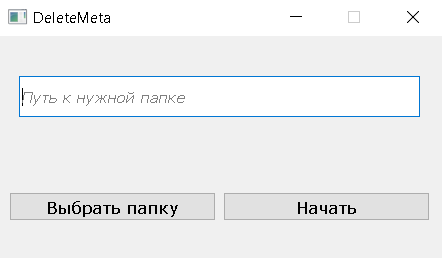
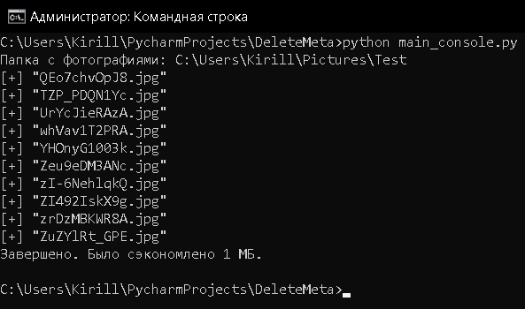
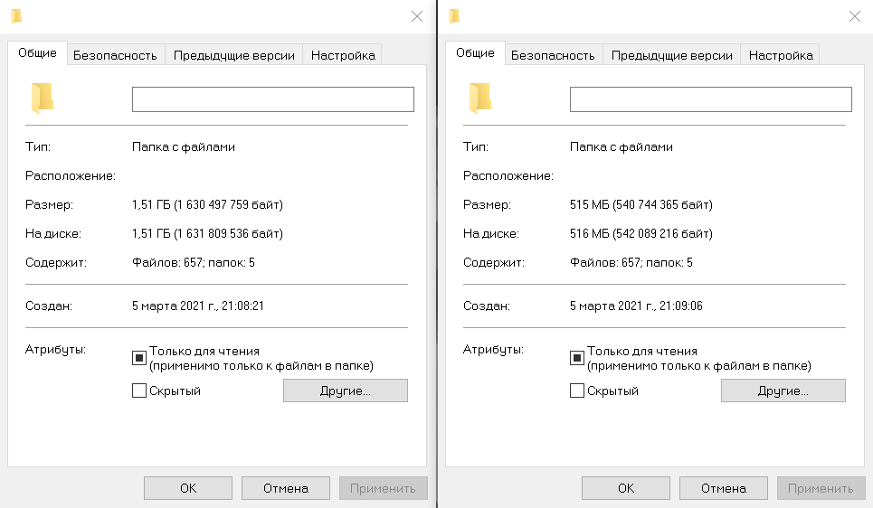
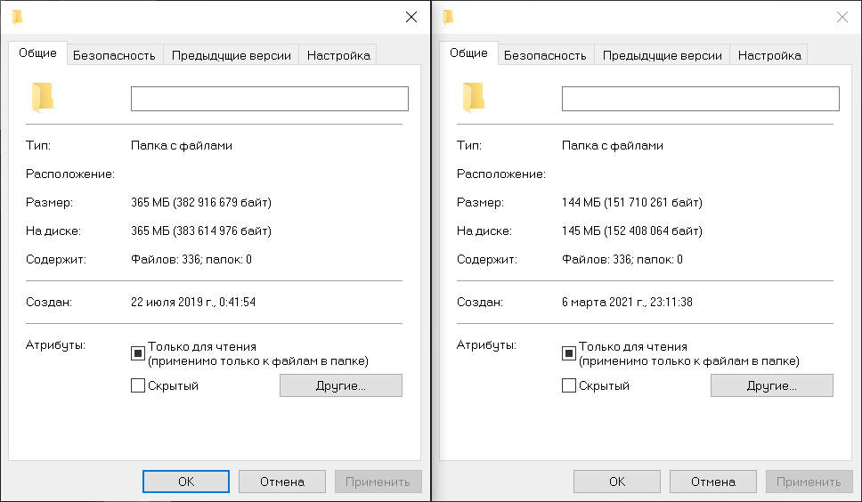

# DeleteMeta
This application reduces the weight of photos by removing meta information

## 1. With UI
```
pip install -U pyqt5 Pillow
python main_UI.py
```


## 2. Console version
```
pip install -U Pillow
python main_console.py
```


# Build
You can use [Pyinstaller](https://pypi.org/project/pyinstaller/) (Python >= 3.6)
```
pip install -U pyinstaller
pyinstaller -F --log-level=WARN --distpath . --noconsole --clean main_UI.py
pyinstaller -F --log-level=WARN --distpath . main_console.py
```
Pillow versions > 7.2 produce a much larger .EXE file

# Results


